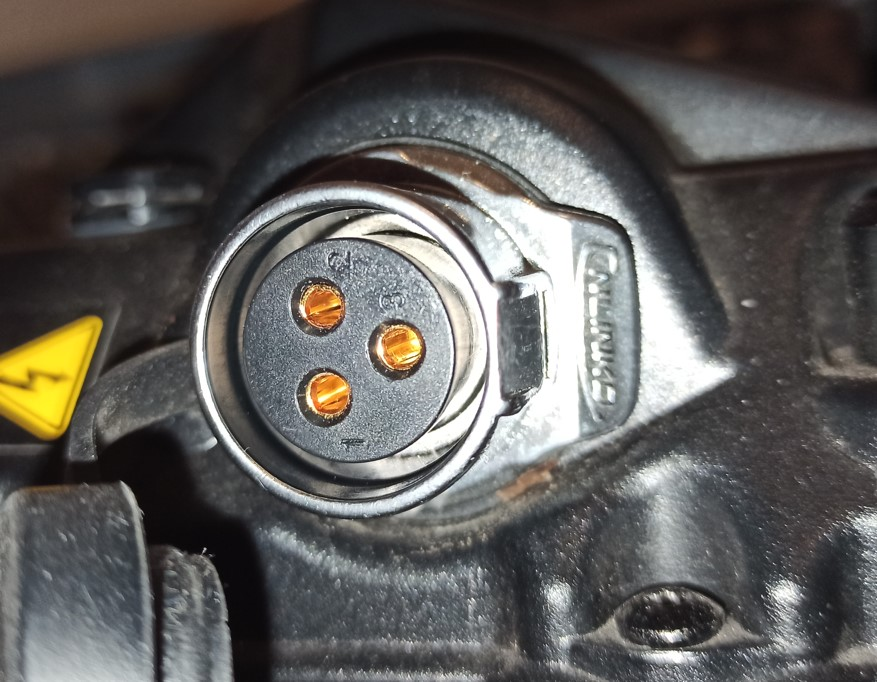
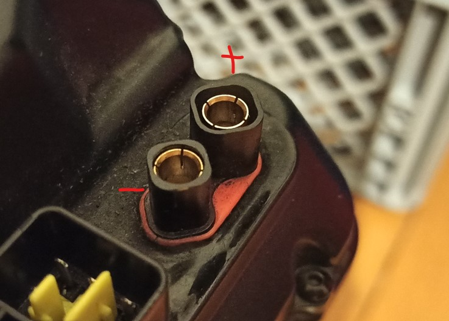
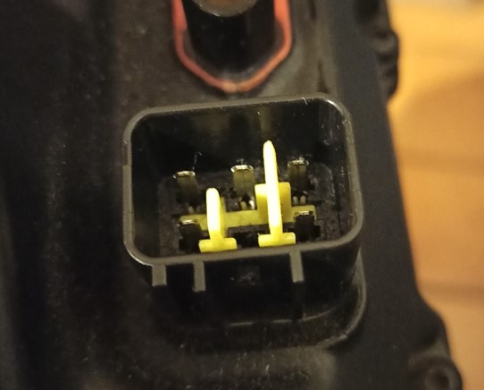

# Surron Light Bee / Firefly
Information about the Surron Light Bee / Firefly and its components. These are compiled for the stock 2022 L1e version, however most probably applies to all models (including the Segway X260, possibly partially the Segway X160 too).

Official documentation:
- [Error/Diagnostic codes](./docs/Diagnostic_chart_X_Series_lead_LED.pdf)
- [Wiring diagram](./docs/Surron_Wiring_Diagram_A_Ebikes.pdf)
- [Torque settings](./docs/Surron_LB_Torque_Settings.pdf)
- [Owner's Manual](./docs/Surron_LBX_Dual-Sport_E-Dirt_Bike_Owners_Manual.pdf)
- [Parts catalogue](./docs/Surron_LBX_Parts_Catalogue.pdf)
- [EU certificate of conformity report](./docs/surronlightbeecoc-papiere.pdf)
- [GPS tracker manual](./docs/Surron_QL-TBOX-JM_User_Manual.pdf)

## Mechanics
### Chain
The stock chain is a 420-106 O-Ring chain (there is a sticker with the specification on the chain guard).

### Belt
The primary drive belt is 560mm long, 16/17mm wide, 8M Profile. The 17mm width seems to be somewhat non-standard as 15mm/20mm are the usual widths, though you _can_ get them in other sizes at some places as well (and some places use/recommend 16mm).

Common replacement belts seem to be:
- Continental Synchroforce HTD 560 8M CXP
- Gates PowerGrip GT3 560-8MGT
- Gates PowerGrip GT4 560-8MGT

### Tires
Tire spec is `70/100-19 41N TT` / `2.5-19 41N TT` and the stock tires are either CST CM727 or CST CM708.

## Electronics

### RS485 Bus

There is an internal RS485 bus between the battery, controller (ESC) and display.

This can be used to read a lot of data from the battery BMS (like health, lifetime capacity (can be used to estimate mileage/efficiency), lifetime min/max temperature, lifetime max charge/discharge current, lifetime min/max cell voltage, manufacturing date, etc.).

Reverse engineering progress of the RS485 protocol is documented under [./bms_comm/README.md](./bms_comm/README.md).

### Battery

The stock battery is in a "60V nominal" 16S configuration.

There are different types of cells used in the batteries (also, battery type can be read from the BMS via RS485):

| Battery       | Cell type                              | Configuration | charge std (max) | discharge std (max) |
|---------------|----------------------------------------|---------------|------------------|---------------------|
| 32Ah / 1900Wh | Panasonic NCR18650PF [^forum-manual]   | 16S11P        | 15A (22A)        | 88A (110A)          |
| 34Ah / 2040Wh | Panasonic NCR18650BD                   | 16S11P        | 10A (16.5A)      | 88A (110A)          |
| 38Ah / 2220Wh | Samsung INR18650-35E [^reddit-battery] | 16S11P        | 11A (22A)        | 88A (143A)          |
| 40Ah / 2400Wh | Panasonic NCR21700A [^reddit-battery]  | 16S8P         | 12A (24A)        | 120A                |

Charging is done via a separate plug with 10A (with the stock charger). The connector pins would allow 20A charging however it is unclear if the BMS might die / overheat when doing so (though probably not).

#### BMS

The BMS is a Greenway LP008[^replacement-bms], which is said to limit the discharge current to around 90A (which is also what the cells are rated for).

Some people do a "BMS bypass mod" to get more power out of the battery (with aftermarket ESCs), which is just putting a link across the BMS so it can never switch off. I would strongly advise against doing so, as you can over-discharge and damage the cells and a short circuit will likely melt the connectors and wires and cause a fire.

According to one forum user's friend (very reliable info, I know) the BMS can be reprogrammed to allow higher current draw[^forum-bms-rs485].

#### Charger
The stock charger seems to be a fairly simple/standard 16S CV/CC charger with 67.2V and 10A.

#### Charge Connector

The charge connector is a 3-pin CNLinko LP-20 ("female socket" on the battery side, "male plug" on the charger side).

The pinout is:
- Pin 1: positive
- Pin 2: negative
- Pin 3: not connected

#### Discharge Connector

The discharge connector is a RCPROPLUS "REB 6808 Pro D6 P8" and uses the "female" contacts for both pins on the battery side. The pin toward the corner of the battery (with the larger plastic shroud around the contact) is the _positive_ terminal.

So the connector on the bike side has two "male" contacts and the one with the larger plastic shroud is the _negative_ terminal.

#### BMS Connector

The connectors can be found under multiple names, but they are (clones of?) Furukawa RFW-series connectors[^bms-connector-datasheet].
- Battery side: `FW-C-6M-B` / `DJ7061Y-2.3-11`
- Bike side: `FW-C-6F-B` / `DJ7061Y-2.3-21`

The [wiring diagram](./docs/Surron_Wiring_Diagram_A_Ebikes.pdf) is pretty helpful here (even though it only has the wire colors). Pin positions are given looking at the bike side connector from the back with the retention clip at the bottom (like in the picture above).

| Position      | Color       | Description                                                                    | Connection                   |
|---------------|-------------|--------------------------------------------------------------------------------|------------------------------|
| Top Center    | Green       | Ground                                                                         |                              |
| Bottom Left   | Red-Black   | 60V in (enables battery display)                                               | from ignition switch         |
| Bottom Right  | White-Red   | RS485 A, data/programming/diagnostics                                          | battery-controller-dashboard |
| Top Right     | White-Black | RS485 B, data/programming/diagnostics                                          | battery-controller-dashboard |
| Top Left      | Black-Blue  | Comms                                                                          | battery-controller           |
| Bottom Center | Purple      | Comms (missing pin on battery, used for diagnostics LED harness[^led-harness]) | battery-controller           |

The communication part of the BMS seems to be galvanically isolated from the battery part (no continuity between ground/RS485 and battery ground).

### Headlights

The stock headlights seem to be of dubious quality (or I am very, very unlucky), as mine has died three times within the two years or so (with one of the two LEDs not lighting up anymore). Due to being replaced in warranty, I could not do an analysis of the failure (yet).

### GPS tracker

There is an official GPS tracker `QL-TBOX-JM` available, for which there is a connector under the seat in recent models. The tracker has an internal battery and runs of the full 60V battery voltage (so it can charge even when the 12V system is inactive).

According to the FCC application `2A92B-QL-TBOX-JM` [^tracker-fcc] and the user manual, the tracker has inputs for power, ignition and CAN, though in the surron, as far as I can tell, only power and ignition are used. 

[^forum-manual]: Inofficial manual, links to official manuals, etc.: https://electricbike.com/forum/forum/knowledge-base/surron/147526-sur-ron-manual

[^reddit-battery]: Reddit post about different batteries: https://www.reddit.com/r/Surron/comments/127tt74/how_is_the_new_40ah_battery_build_which/

[^forum-bms-rs485]: 
    Forum posts with claims about BMS RS485 capabilities:
    - https://endless-sphere.com/sphere/threads/sur-ron-new-mid-drive-bike.89902/page-221#post-1665199
    - https://endless-sphere.com/sphere/threads/sur-ron-new-mid-drive-bike.89902/page-222#post-1669303

[^replacement-bms]: Replacement BMS pictures: https://surron.at/produkt/sur-ron-batteriemanagement-bms/

[^bms-connector-datasheet]: BMS connector datasheet https://www.furukawa.co.jp/product/catalogue/pdf/auto/auto_wpcon_01rfw.pdf

[^led-harness]: Diagnostic harness description https://endless-sphere.com/sphere/threads/sur-ron-new-mid-drive-bike.89902/post-1736885

[^tracker-fcc]: GPS tracker FCC application (FCCID `2A92B-QL-TBOX-JM`):
    - https://fccid.io/2A92B-QL-TBOX-JM
    - https://www.fcc.gov/oet/ea/fccid