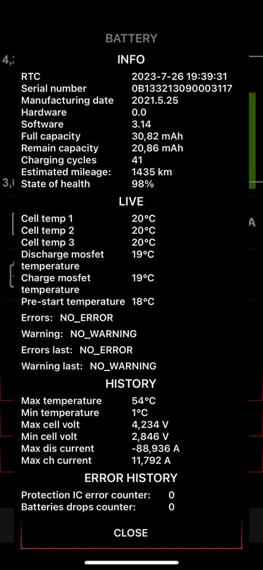

# RS485 communication

RS485 communication is done at 9600 baud 8N1. The battery always responds to requests, even when it is not actively enabled (using the 60V input).

All messages seem to have the same structure:
- Command (`46` = request, `47` = response, `57` = unsolicited)
- Address (2 bytes)
- Parameter id (1 byte)
- Parameter length (1 byte)
- Data (0 - n bytes)
- Checksum (1 byte = sum of all previous bytes)

Full message dumps of the bike (sniffed at the battery BMS connection) are available under `dumps`

Example code to work with the Surron RS485 bus is available under `src`

My theory is, that the controller/ESC is the bus controller (only bus member that can send without being asked to), the battery responds to requests and the display only reads.
Points in case:
- responses (`47`) stop when battery is detached (requests and unsolicited messages keep on going)
- unsolicited messages (`57`) contain the data received in the responses with a slight delay
- unsolicited messages (`57`) contain multiple parameters (like battery percentage, battery voltage, status, etc.), which suggest those messages are aimed at the display.

## Commands
## `46` (Request)
request for a value / list of values
- byte 0: command
- byte 1-2: address
- byte 3: parameter
- byte 4: data length
- last byte: checksum 

| cmd  | addr   | param | len  | chk  |
|------|--------|-------|------|------|
| `46` | `1601` | `07`  | `01` | `65` |
| `46` | `1601` | `08`  | `06` | `6B` |
| `46` | `1601` | `09`  | `04` | `6A` |
| `46` | `1601` | `0D`  | `01` | `6B` |

## `47` (Response)
response to `46`
- byte 0: command
- byte 1-2: address
- byte 3: parameter
- byte 4: data length
- bytes n: data
- last byte: checksum

| cmd  | addr   | param | len  | data           | chk  |
|------|--------|-------|------|----------------|------|
| `47` | `1601` | `07`  | `01` | `05`           | `65` |
| `47` | `1601` | `08`  | `06` | `10100F001111` | `BD` |
| `47` | `1601` | `09`  | `04` | `6BF20000`     | `C8` |
| `47` | `1601` | `0D`  | `01` | `4B`           | `B7` |

## `57` (Unsolicited Response)
- byte 0: command
- byte 1-2: address
- byte 3: parameter
- byte 4: data+checksum length
- bytes n: data
- last byte: checksum

| cmd  | addr   | param | len  | data                     | chk  |
|------|--------|-------|------|--------------------------|------|
| `57` | `8301` | `48`  | `0C` | `0000000000000080000000` | `AF` |
| `57` | `8301` | `48`  | `0C` | `4B63F20000000080000000` | `4F` |
| `57` | `8301` | `4B`  | `02` | `00`                     | `28` |

## Parameter Reverse Engineering
### Bike (ESC) sniffing
Some parameters are requested from the BMS by the ESC:

| param | meaning known? |
|-------|----------------|
| 7     |                |
| 8     | x              |
| 9     | x              |
| 13    | x              |
| 22    |                |

### BMS read brute force
Just requesting from battery with `461601XXXXXX`.

Length can be set up to 64 (though param 160 only responds up to around 32), which returns more data than is actually in the field (it seems like it reads past its buffer and subsequent params are returned when doing so).

Lengths can be determined somewhat by counting bytes until the next param is returned.

### Torp TC500
There is an aftermarket ESC called "Torp TC500", which has the Surron RS485 communication implemented.

There is an app that shows the battery parameters, so we can at least know which parameters there are (random screenshot from Google Images):

</img>

| Parameter Name                     | Parameter ID                    |
|------------------------------------|---------------------------------|
| RTC                                | 29                              |
| Serial Number                      | 35                              |
| Manufacturing Date                 | 27                              |
| Hardware Version                   | ???                             |
| Software Version                   | 26                              |
| Full capacity                      | 16                              |
| Remain capacity                    | 15                              |
| Charging Cycles                    | 17/23???                        |
| Estimated mileage                  | ???                             |
| State of health                    | 14?                             |
| Temperatures                       | 8 (exact mapping still unknown) |
| Error/Warning Flags                | ???                             |
| History (max/min temp, curr, volt) | 38                              |
| Protection IC error counter        | ???                             |
| Battery drop counter               | ???                             |

### Greenway BMS App

There is an Android app from the BMS manufacturer that can be found [here](https://imb.greenway-battery.com/assets/imb/page/download.html) (Direct link!).

The Surron BMS does not have Bluetooth so it can't be used with the app, however the protocol / fields are probably similar.

A decompiled version of the function where the bytes are decoded can be found in [Greenway_App_Parser.java](./Greenway_App_Parser.java)

## Parameter Map

Unsure lengths/descriptions are marked with `?`. More question marks = more uncertainty.

| param | len   | data                                                               | desc                                                   |
|------:|-------|--------------------------------------------------------------------|--------------------------------------------------------|
|     0 | <=4?  | `46000000`                                                         | ?                                                      |
|     7 | 1     | `05`                                                               | ?                                                      |
|     8 | 6     | `10100F001111`/`151515001515`/`161616001B1B`/`161716001B1B`        | Temperatures (`161716001B1B` sbyte => 22°C, 23°C, ...) |
|     9 | 4     | `63F20000`                                                         | Battery Voltage (`63F20000` uint32/1000 => 62.051V)    |
|    10 | 4     | `00000000`/`10000000`/`F0FFFFFF`/`B7FAFFFF`                        | Battery Current (`B7FAFFFF` int32/1000 => -1.353A)     |
|    13 | 1     | `4B`                                                               | Battery Percent (`4B` => 75%)                          |
|    14 | <=4?  | `64000000`                                                         | Battery Health? (`64` => 100%)                         |
|    15 | 4     | `CA680000`                                                         | Remaining Capacity (`13680000` uint32 => 26643mAh)     |
|    16 | 4     | `128B0000`                                                         | Total Capacity? (`128B0000` uint32 => 35602mAh)        |
|    17 | <=2?  | `4000`                                                             | Charging Cycles??? (`4000` uint16 => 64)               |
|    20 | <=4?  | `80027F32`                                                         | ?                                                      |
|    21 | ???   | `128B0000[...]`                                                    | ?                                                      |
|    22 | 9     | `E00300000000000000`/`200000000000000000`                          | Status flags??                                         |
|    23 | <=4?  | `4E000000`                                                         | Charging Cycles??? (`4E000000` uint32 => 78)           |
|    24 | <=4?  | `A4880000`                                                         | ?                                                      |
|    25 | <=4?  | `00E10000`                                                         | ?                                                      |
|    26 | <=8?  | `0E03000055343237`                                                 | Software Version? (`0E` `03` => 3.14)                  |
|    27 | 3     | `160301`                                                           | Manufacture Date (2022-03-01)                          |
|    28 | <=4?  | `00000000`                                                         | ?                                                      |
|    29 | 6     | `180307062F02`                                                     | RTC time (`180307062F02` => 2024-03-07T06:47:02)       |
|    30 | <=6?  | `000071032201`/`000071032301`                                      | ?                                                      |
|    32 | <=16? | `475245454E5741590000000000000000`                                 | BMS Manufacturer (ASCII "GREENWAY")                    |
|    33 | <=32? | `444D373331363131000000000000000000000000000000000000000000000000` | Battery Model? (ASCII "DM731611")                      |
|    34 | <=16? | `4E435231383635304244000000000000`                                 | Cell Type (ASCII "NCR18650BD")                         |
|    35 | <=32? | `3074313858303633313136393032323236000000000000000000000000000000` | Serial Number (ASCII "0t18X063116902226")              |
|    36 | 32    | `280F230F230F230F230F280F290F290F280F290F270F290F290F2A0F270F2D0F` | Cell voltages (`280F` uint16/1000 => 3.880V)           |
|    37 | <=32? | `0000000000000000000000000000000000000000000000000000000000000000` | ?                                                      |
|    38 | 14    | `4DA7FEFFF93C000080100C0C3302`                                     | History (see [below](#history-bytes))                  |
|    39 | ???   | `FFFFFFFFFFFFFFFFFFFFFFFFFFFFFFFF0200FFFFFFFFFFFFFFFFFFFF0900FFFF` | ?                                                      |
|    48 | ???   | `0000000000000000000000000000000000000000000000000000000000000000` | ?                                                      |
|   120 | ???   | `0000000000000000000000000000000000000000000000000000000000000000` | ?                                                      |
|   160 | ???   | `20000000000000004B647AF20000F0FFFFFF1515161600004E00000000000000` | ? (does not respond with length >32)                   |

### History Bytes
Example: `4DA7FEFFF93C000080100C0C3302`
- byte 0-3: `4DA7FEFF` int32/1000 => -88.243A (Max Discharge Current)
- byte 4-7: `F93C0000` int32/1000 => 15.609A (Max Charge Current)
- byte 8-9: `8010` uint16/1000 => 4.224V (Max Cell Voltage)
- byte 10-11: `0C0C` uint16/1000 => 3.084V (Min Cell Voltage)
- byte 12: `33` sbyte => 51°C (Max Temperature)
- byte 13: `02` sbyte => 2°C (Min Temperature)

## From Dumps

### 1601_07_01
#### Request:
- `461601070165`

#### Response:
- `4716010701056B`

#### Captured values:
- `05`

#### Explanation:
???

### 1601_08_06
#### Request:
- `46160108066B`

#### Response:
- `471601080610100F001111BD`
- `47160108060F100F001111BC`

#### Captured values:
- `10100F001111`
- `0F100F001111`
- `0F0F0F001111`
- `151515001515`
- `151515001616`

#### Explanation:
???

### 1601_09_04
#### Request:
- `46160109046A`

#### Response:
- `47160109046BF20000C8`
- `47160109046AF20000C7`

#### Captured values:
- `6BF20000`
- `6AF20000`
- `63F20000`
- `5CF20000`
- `24F20000`
- [...]

#### Explanation
Battery voltage (uint32 `63F20000` => 62.051V)

(Plot of `output_2024-03-05_22-15-39_standup_gas_standown.log`)

### 1601_0D_01

#### Request:
- `4616010D016B`

#### Response:
- `4716010D014BB7`

#### Captured values:
- `4B`

#### Explanation:
Battery percent? (`4B` => 75%)

### 1601_16_09
#### Request:
- `46160116097C`

#### Response:
- `4716011609E0030000000000000060`

#### Captured values:
- `E00300000000000000`
- `200000000000000000`

#### Explanation:
???

### 8301_48_0C

- `578301480C0000000000000080000000AF`
- `578301480C0000000000000081000000B0`
- `578301480C4B63F200000000800000004F`
- `578301480C4B58F20000000000000000C4`
- `578301480C4B49F20000000000000000B5`
- `578301480C4B51F200000000800000003D`

#### Captured values:
- `0000000000000080000000` (battery missing)
- `0000000000000081000000` (battery missing)
- `4B00000000000080000000` (startup, kickstand down)
- `4B6BF20000000080000000` (kickstand down)
- `4B56F20000000000000000` (kickstand up)
- `4B55F20000000080000000` (kickstand down)
- `4B57F20000000200000000` (kickstand up, brake pulled?)

#### Explanation:
- Byte 0: Battery percent? (`4B` => 75%)
- Byte 1-4: Battery voltage (uint32 `63F20000` => 62.051V)
- Byte 5: ???
- Byte 6: Brake status? (usually `00`, can be `02`)
- Byte 7: Error/Status Flags? (`81` with missing battery, `80` with kickstand down, `00` with kickstand up)
- Bytes 8-10: ???

(Plot of `output_2024-03-05_22-15-39_standup_gas_standown.log`)

### 8301_4B_02

- `5783014B020129`
- `5783014B020830`
- `5783014B020028`

#### Captured values:

- `01`
- `08`
- `00`
- `80`
- `10`
- `20`

#### Explanation:
has something to do with config via brake switch:
- normal:  `01` -> `08` -> `00`
- regen 1 (unsure): `01` -> `10` -> `20` -> `00`
- regen 2 (unsure): `01` -> `08` -> `10` -> `00`
- regen 3 (unsure): `01` -> `20` -> `08` -> `00`

(Plot of `output_2024-03-05_22-17-59_startup_regen_3.log`)
