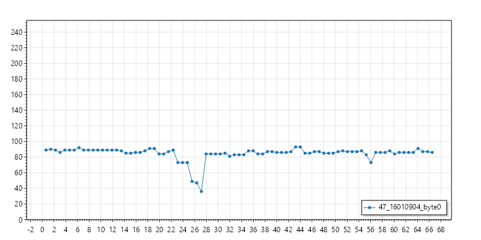
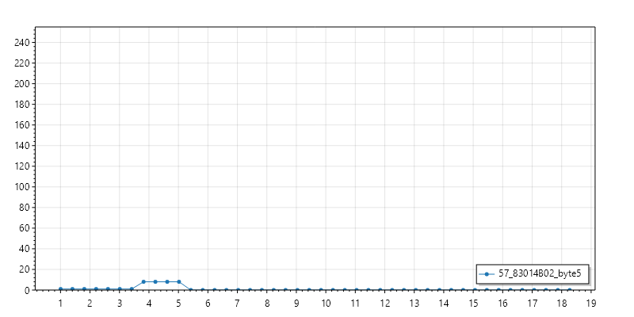

# RS485 communication

RS485 communication is done at 9600 baud 8N1.

All messages seem to have the same structure:
- Command (`46` = request, `47` = response, `57` = unsolicited)
- Address (2 bytes)
- Parameter (1 byte)
- Parameter length (1 byte)
- Data (0 - n bytes)
- Checksum (1 byte = sum of all previous bytes)

Full message dumps of the bike (sniffed at the battery BMS connection) are available under `dumps`

## Commands
## `46` (Request)
request for a value / list of values
- byte 0: command
- byte 1-2: address
- byte 3: parameter
- byte 4: data length
- last byte: checksum 

| cmd | addr | param | len | chk |
|---|---|---|---|---|
|`46`|`1601`|`07`|`01`|`65`|
|`46`|`1601`|`08`|`06`|`6B`|
|`46`|`1601`|`09`|`04`|`6A`|
|`46`|`1601`|`0D`|`01`|`6B`|

## `47` (Response)
response to `46`
- byte 0: command
- byte 1-2: address
- byte 3: parameter
- byte 4: data length
- bytes n: data
- last byte: checksum

| cmd | addr | param | len | data | chk |
|---|---|---|--- |---|---|
|`47`|`1601`|`07`|`01`|`05`|`65`|
|`47`|`1601`|`08`|`06`|`10100F001111`|`BD`|
|`47`|`1601`|`09`|`04`|`6BF20000`|`C8`|
|`47`|`1601`|`0D`|`01`|`4B`|`B7`|

## `57` (Unsolicited Response)
- byte 0: command
- byte 1-2: address
- byte 3: parameter
- byte 4: data+checksum length
- bytes n: data
- last byte: checksum

| cmd | addr | param | len | data | chk |
|---|---|---|--- |---|---|
|`57`|`8301`|`48`|`0C`|`0000000000000080000000`|`AF`|
|`57`|`8301`|`48`|`0C`|`4B63F20000000080000000`|`4F`|
|`57`|`8301`|`4B`|`02`|`00`|`28`|

## Fields

### 1601_07_01
#### Request:
- `461601070165`

#### Response:
- `4716010701056B`

#### Captured values:
- `05`

#### Explanation:
???

### 1601_08_06
#### Request:
- `46160108066B`

#### Response:
- `471601080610100F001111BD`
- `47160108060F100F001111BC`

#### Captured values:
- `10100F001111`
- `0F100F001111`
- `0F0F0F001111`

#### Explanation:
Maybe some sort of bootup counter? Too little info to be certain

### 1601_09_04
#### Request:
- `46160109046A`

#### Response:
- `47160109046BF20000C8`
- `47160109046AF20000C7`

#### Captured values:
- `6BF20000`
- `6AF20000`
- `63F20000`
- `5CF20000`
- `24F20000`
- [...]

#### Explanation
Battery voltage (uint32 `63F20000` => 62.051V)

(Plot of `output_2024-03-05_22-15-39_standup_gas_standown.log`)

### 1601_0D_01

#### Request:
- `4616010D016B`

#### Response:
- `4716010D014BB7`

#### Captured values:
- `4B`

#### Explanation:
Battery percent? (`4B` => 75%)

### 1601_16_09
#### Request:
- `46160116097C`

#### Response:
- `4716011609E0030000000000000060`

#### Captured values:
- `E00300000000000000`

#### Explanation:
???

### 8301_48_0C

- `578301480C0000000000000080000000AF`
- `578301480C0000000000000081000000B0`
- `578301480C4B63F200000000800000004F`
- `578301480C4B58F20000000000000000C4`
- `578301480C4B49F20000000000000000B5`
- `578301480C4B51F200000000800000003D`

#### Captured values:
- `0000000000000080000000` (battery missing)
- `0000000000000081000000` (battery missing)
- `4B00000000000080000000` (startup, kickstand down)
- `4B6BF20000000080000000` (kickstand down)
- `4B56F20000000000000000` (kickstand up)
- `4B55F20000000080000000` (kickstand down)
- `4B57F20000000200000000` (kickstand up, brake pulled?)

#### Explanation:
- Byte 0: Battery percent? (`4B` => 75%)
- Byte 1-4: Battery voltage (uint32 `63F20000` => 62.051V)
- Byte 5: ???
- Byte 6: Brake status? (usually `00`, can be `02`)
- Byte 7: Error/Status Flags? (`81` with missing battery, `80` with kickstand down, `00` with kickstand up)
- Bytes 8-10: ???

(Plot of `output_2024-03-05_22-15-39_standup_gas_standown.log`)

### 8301_4B_02

- `5783014B020129`
- `5783014B020830`
- `5783014B020028`

#### Captured values:

- `01`
- `08`
- `00`
- `80`
- `10`
- `20`

#### Explanation:
has something to do with config via brake switch:
- normal:  `01` -> `08` -> `00`
- regen 1 (unsure): `01` -> `10` -> `20` -> `00`
- regen 2 (unsure): `01` -> `08` -> `10` -> `00`
- regen 3 (unsure): `01` -> `20` -> `08` -> `00`

(Plot of `output_2024-03-05_22-17-59_startup_regen_3.log`)
